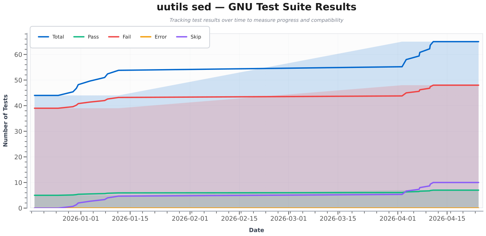

# Various tracking tools for sed

Tracking the evolution of https://github.com/uutils/sed

## GNU testsuite comparison

Below is the evolution of how many GNU tests uutils/sed passes.

Refreshed twice a day by github actions. Changes are documented in the json file ([gnu-result.json](gnu-result.json)).

Compares only the Linux execution.

Based on:
* https://github.com/uutils/sed/blob/main/util/run-gnu-testsuite.sh
